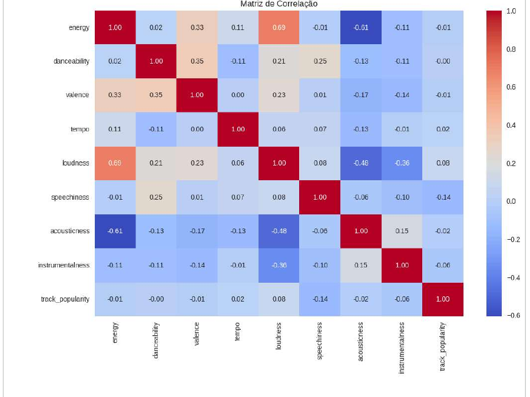
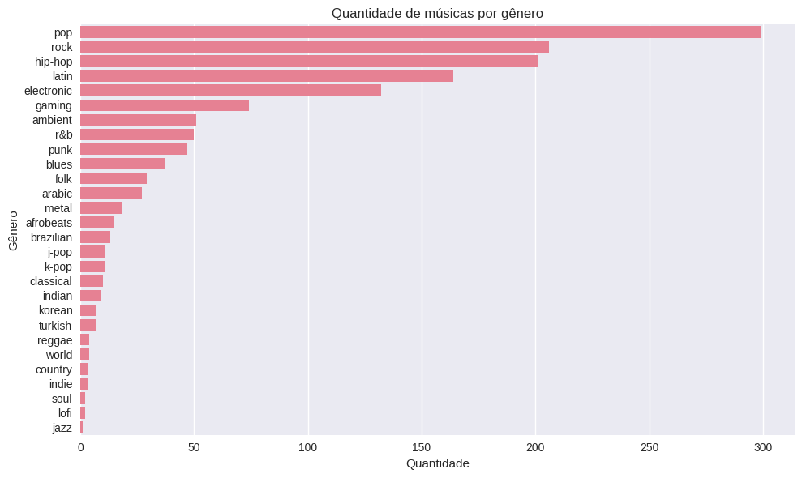
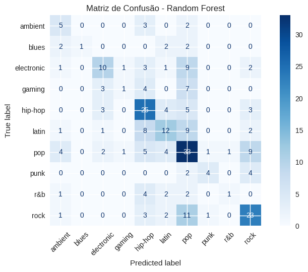

# 🎵 Análise de Músicas Populares no Spotify


Análise exploratória, análise estatística e Machine Learning sobre as músicas mais populares do Spotify, reunidas em um único notebook e um relatório completo.

Trabalho desenvolvido no **Instituto Federal de Santa Catarina (IFSC)**, curso de Sistemas de Informação, nas disciplinas de **Big Data** e **Probabilidade e Estatística**.

**Autor:** Ramon Lodi de Sousa

---

## 🎯 Objetivo

Responder duas perguntas sobre músicas que já são populares:

1. As características sonoras (energia, dançabilidade, BPM, etc.) explicam o quão popular uma música é?
2. Essas mesmas características permitem prever o gênero musical?

## 📦 Dataset

- **Fonte:** [Spotify Music Dataset (Kaggle)](https://www.kaggle.com/datasets/solomonameh/spotify-music-dataset)
- **Arquivo usado:** `high_popularity_spotify_data.csv`
- **Tamanho:** 1.686 linhas × 29 colunas (atualizado em 2025)

## 🧭 O que há aqui

| Parte | Conteúdo | Seções do notebook |
| --- | --- | --- |
| **I. Dados** | Contexto, dataset, carregamento, visão geral e qualidade dos dados | 1–6 |
| **II. Análise exploratória** | Análises univariada, bivariada e multivariada | 7–9 |
| **III. Análise estatística** | Média, mediana, moda, variância, desvio padrão e dados agrupados | 10–12 |
| **IV. Machine Learning** | Classificação do gênero musical com CRISP-DM (4 modelos + baseline) | 13 |
| | Conclusão geral, limitações e extensões | 14 |

O fio condutor: as Partes I–III mostram que as características sonoras quase não explicam a popularidade entre músicas já populares; a Parte IV pergunta se elas ao menos permitem prever o gênero.

## 📊 Principais resultados

- **Perfil predominante:** músicas energéticas, dançantes, ~120 BPM e ~3,5 min; o pop domina os gêneros.
- **Popularidade:** correlação muito fraca com todos os atributos sonoros (entre −0,14 e +0,08).
- **Gênero:** previsível acima do acaso, mas não de forma confiável: ~45% de acurácia (Random Forest e Regressão Logística empatados) contra ~24% do baseline "sempre pop".
- Erros concentrados em gêneros pequenos; o pop atua como "classe atratora".

### Visualizações

**Correlação entre atributos e popularidade**



**Distribuição dos gêneros**



**Matriz de confusão (melhor modelo)**



> Detalhes, demais gráficos e ressalvas em [`docs/RELATORIO.md`](spotify-popular-analysis/docs/RELATORIO.md).

## 🛠️ Tecnologias

- Python
- Pandas e NumPy
- Matplotlib e Seaborn
- Scikit-learn
- Jupyter Notebook

## 📁 Estrutura do repositório

```
.
├── spotify-popular-analysis/
│   ├── notebooks/
│   │   └── analise_spotify.ipynb   # notebook unificado (Partes I a IV)
│   ├── docs/
│   │   └── RELATORIO.md            # relatório com descrição e análises
│   ├── images/                     # gráficos usados no relatório e no README
│   ├── data/
│   │   └── README.md               # como obter o CSV (não versionado)
│   └── requirements.txt
├── LICENSE
└── README.md
```

## ▶️ Como executar

**1. Obtenha o dataset.** Baixe no [Kaggle](https://www.kaggle.com/datasets/solomonameh/spotify-music-dataset) apenas o arquivo `high_popularity_spotify_data.csv`.

**2. Escolha onde rodar.**

- **Kaggle:** adicione o dataset ao notebook. O caminho é detectado automaticamente.
- **Google Colab:** envie o notebook, crie a pasta `data/` no ambiente e envie o CSV para ela antes de rodar.
- **Local:**

```bash
python -m venv .venv
source .venv/bin/activate        # Windows: .venv\Scripts\activate
pip install -r requirements.txt
# coloque o CSV em data/high_popularity_spotify_data.csv
jupyter notebook notebooks/analise_spotify.ipynb
```

O notebook procura o CSV em `/kaggle/input/...`, em `data/` e em `../data/`, nessa ordem.

## ⚠️ Observações importantes

- O notebook é entregue **sem saídas** (limpo). Execute-o para gerar todos os números e gráficos.
- Os valores e gráficos do relatório vêm das execuções originais dos três trabalhos sobre o dataset real. Reexecutar com outra versão do scikit-learn pode alterar levemente os números da Parte IV.
- As Partes II–III usam as 1.686 linhas do dataset; a Parte IV usa **faixas únicas** (evita vazamento de dados), o que é explicado na seção 13.1 do notebook.
- A seção 14 do relatório lista as inconsistências encontradas entre os trabalhos e como foram tratadas.

## 🔮 Limitações e próximos passos

- O dataset só contém músicas já populares, o que limita a variação da variável popularidade.
- Gêneros pequenos têm poucos exemplos, o que prejudica a classificação.
- Possíveis extensões: balanceamento de classes, agrupamento de gêneros, ajuste de hiperparâmetros e testes com outros modelos.

## 🔗 Links

- 🎥 [Vídeo de apresentação (Big Data)](https://www.loom.com/share/4d6563cc3bc14d7fb57818a299ce1074)
- 📊 [Dataset no Kaggle](https://www.kaggle.com/datasets/solomonameh/spotify-music-dataset)

## 👤 Autor

**Ramon Lodi de Sousa**
[GitHub](https://github.com/ramonlodi) · <!-- adicione seu LinkedIn: [LinkedIn](https://linkedin.com/in/seu-usuario) -->

## 📄 Licença

Distribuído sob a licença MIT. Veja o arquivo `LICENSE` para mais detalhes.
