# Análise de Músicas Populares no Spotify

**Análise Exploratória · Análise Estatística · Machine Learning**

| | |
|---|---|
| **Instituição** | Instituto Federal de Santa Catarina (IFSC) — Sistemas de Informação |
| **Disciplinas** | Big Data · Probabilidade e Estatística |
| **Estrutura** | Parte I Dados · Parte II Exploratória · Parte III Estatística · Parte IV Machine Learning |
| **Autor** | Ramon Lodi de Sousa |
| **Dataset** | [Spotify Music Dataset — Kaggle](https://www.kaggle.com/datasets/solomonameh/spotify-music-dataset) |
| **Notebook** | [`notebooks/analise_spotify.ipynb`](../notebooks/analise_spotify.ipynb) |

> **Sobre os números deste documento.** Todos os valores e gráficos abaixo foram extraídos dos três trabalhos originais
> (relatório de Estatística e os dois notebooks de Big Data, exploratório e de Machine Learning, executados sobre o
> dataset real). Para reproduzi-los, execute o notebook com o CSV original, veja o [README](../README.md).

---

## Sumário

1. [Introdução](#1-introdução)
2. [Objetivos](#2-objetivos)
3. [Descrição do dataset](#3-descrição-do-dataset)
4. [Visão geral e qualidade dos dados](#4-visão-geral-e-qualidade-dos-dados)
5. [Análise univariada](#5-análise-univariada)
6. [Análise bivariada](#6-análise-bivariada)
7. [Análise multivariada](#7-análise-multivariada)
8. [Medidas de tendência central](#8-medidas-de-tendência-central)
9. [Medidas de dispersão](#9-medidas-de-dispersão)
10. [Dados agrupados em classes](#10-dados-agrupados-em-classes)
11. [Machine Learning: classificação do gênero musical](#11-machine-learning-classificação-do-gênero-musical)
12. [Conclusão geral](#12-conclusão-geral)
13. [Limitações e trabalhos futuros](#13-limitações-e-trabalhos-futuros)
14. [Observações sobre a unificação dos trabalhos](#14-observações-sobre-a-unificação-dos-trabalhos)

---

## 1. Introdução

A indústria musical passou por grandes transformações com o crescimento das plataformas de streaming digital.
Serviços como o Spotify utilizam algoritmos e métricas para recomendar músicas e organizar playlists,
influenciando diretamente o consumo musical.

Nesse contexto, características sonoras como energia, dançabilidade, valência emocional e tempo musical podem
estar relacionadas ao sucesso de determinadas músicas. Este trabalho explora essas características por meio de
técnicas de análise exploratória de dados, de análise estatística e de aprendizado de máquina.

## 2. Objetivos

- Identificar padrões, relações e características musicais associadas à popularidade de músicas presentes em playlists do Spotify.
- Aplicar análise exploratória (histogramas, boxplots, gráficos de barras, dispersão e correlação).
- Aplicar conceitos de Probabilidade e Estatística: média, moda, mediana, variância, desvio padrão, e medidas de tendência central e de dispersão.
- Aplicar um processo de Aprendizado de Máquina supervisionado (CRISP-DM) para prever o gênero de uma música a partir de suas características sonoras.
- Utilizar Python e bibliotecas de análise, visualização e modelagem (pandas, NumPy, Matplotlib, Seaborn, scikit-learn).

## 3. Descrição do dataset

O dataset contém músicas populares extraídas do Spotify, com informações musicais, métricas de popularidade e
características sonoras geradas pela API da plataforma.

- **Fonte:** <https://www.kaggle.com/datasets/solomonameh/spotify-music-dataset>
- **Arquivo utilizado:** `high_popularity_spotify_data.csv` (somente este)
- **Última atualização do dataset:** 2025
- **Dimensão:** 1.686 linhas × 29 colunas

### 3.1. Dicionário de variáveis

As descrições foram retiradas da página oficial do dataset no Kaggle.

**Variáveis sonoras e numéricas**

| Variável | Descrição | Tipo |
|---|---|---|
| `energy` | Nível de intensidade e energia da música | Contínua |
| `tempo` | Velocidade da música, em BPM (batidas por minuto) | Contínua |
| `danceability` | Quão adequada a música é para dançar | Contínua |
| `loudness` | Volume geral da música, em decibéis (dB) | Contínua |
| `valence` | Positividade emocional da música | Contínua |
| `liveness` | Probabilidade de ser uma apresentação ao vivo | Contínua |
| `speechiness` | Presença de fala ou palavras faladas | Contínua |
| `instrumentalness` | Probabilidade de ser instrumental, sem vocais | Contínua |
| `acousticness` | Probabilidade de possuir características acústicas | Contínua |
| `duration_ms` | Duração da música, em milissegundos | Contínua |
| `track_popularity` | Índice de popularidade no Spotify | Discreta |
| `time_signature` | Compasso musical da faixa | Discreta |
| `key` | Tom musical, representado numericamente | Discreta |

**Variáveis categóricas e identificadores**

| Variável | Descrição | Tipo |
|---|---|---|
| `playlist_genre` | Gênero musical principal associado à playlist | Nominal |
| `playlist_subgenre` | Subgênero associado à playlist | Nominal |
| `mode` | Modalidade musical (maior/menor) | Nominal |
| `track_name` | Nome da música | Nominal |
| `track_artist` | Artista(s) da música | Nominal |
| `track_album_name` | Nome do álbum | Nominal |
| `track_album_release_date` | Data de lançamento do álbum | Nominal |
| `playlist_name` | Playlist oficial onde a música está inserida | Nominal |
| `track_id`, `id`, `uri`, `track_album_id`, `playlist_id` | Identificadores | Nominal |
| `track_href`, `analysis_url`, `type` | Metadados da API do Spotify | Nominal |

> **Recorte por trabalho.** O trabalho de **Big Data (exploratório)** utilizou as 29 colunas. O de **Estatística**
> utilizou apenas 10: `track_name`, `track_artist`, `energy`, `tempo`, `danceability`, `playlist_genre`, `loudness`,
> `valence`, `track_popularity` e `duration_ms`. O de Machine Learning utilizou 14 variáveis preditoras
> (`energy`, `tempo`, `danceability`, `loudness`, `liveness`, `valence`, `time_signature`, `speechiness`,
> `track_popularity`, `instrumentalness`, `mode`, `key`, `duration_ms`, `acousticness`) e o alvo `playlist_genre`.

---

## 4. Visão geral e qualidade dos dados

### 4.1. Estrutura

- 1.686 registros e 29 colunas: 9 `float64`, 5 `int64` e 15 `object`.
- Todas as colunas com 1.686 valores não nulos, exceto `track_album_name` (1.685) na leitura padrão do pandas.

### 4.2. Estatísticas descritivas (`describe()`)

| Estatística | energy | tempo | danceability | loudness | liveness | valence | time_signature |
|---|---:|---:|---:|---:|---:|---:|---:|
| média | 0,667 | 121,071 | 0,650 | −6,704 | 0,172 | 0,526 | 3,950 |
| desvio padrão | 0,185 | 27,066 | 0,158 | 3,377 | 0,124 | 0,236 | 0,327 |
| mínimo | 0,002 | 49,305 | 0,136 | −43,643 | 0,021 | 0,035 | 1 |
| 25% | 0,551 | 100,059 | 0,543 | −7,950 | 0,093 | 0,339 | 4 |
| mediana | 0,689 | 120,001 | 0,665 | −5,975 | 0,121 | 0,528 | 4 |
| 75% | 0,807 | 136,834 | 0,769 | −4,687 | 0,210 | 0,720 | 4 |
| máximo | 0,990 | 209,688 | 0,979 | 1,295 | 0,950 | 0,978 | 5 |

**Primeiras observações**

- As músicas mais populares tendem a ser energéticas (média 0,667; mediana 0,689) e dançantes (mediana 0,665).
- **Pouca dispersão de popularidade:** média ≈ 75,8 e desvio padrão ≈ 6,03.
- As músicas populares **não têm forte caráter instrumental**: são majoritariamente vocais.
- O `loudness` tem um valor mínimo de **−43,6 dB**, muito distante do restante (mediana −5,97 dB) — um outlier evidente.

### 4.3. Valores ausentes

Na leitura padrão, o pandas apontou 1 valor ausente (0,059%) em `track_album_name`, na linha da faixa do
artista NAYEON (gênero k-pop). Como o `track_album_id` estava preenchido, pesquisou-se o ID e verificou-se que
o álbum se chama literalmente "NA", que o pandas interpreta como `NaN`. A correção foi reler o arquivo com
`keep_default_na=False`.

**Resultado:** nenhum valor ausente.

### 4.4. Valores duplicados

"Duplicata" depende do critério. O mesmo dataset gerou três números diferentes nos trabalhos originais:

| Critério | Trabalho | Resultado |
|---|---|---:|
| Linha idêntica nas **29 colunas** | Big Data (exploratório) | **0** |
| Linha idêntica nas **10 colunas** selecionadas | Estatística | **99** |
| Mesmo **`track_id`** | Big Data (Machine Learning) | **249** (1.686 → 1.437 faixas únicas) |

Não há contradição, são critérios distintos. A mesma faixa aparece em mais de uma playlist: mudam `playlist_name`,
`playlist_id`, `playlist_subgenre` e afins, mas o `track_id` e as características sonoras são os mesmos. Ao restringir
a 10 colunas, descartam-se as colunas que distinguiam as linhas, e surgem repetições. Trata-se de uma característica dos
dados, e não de um erro. A conclusão correta é:

> *Não há linhas duplicadas no dataset completo; há faixas repetidas em playlists diferentes.*

**Decisão adotada.** As Partes II e III descrevem as 1.686 entradas (cada aparição de uma música numa playlist),
como nos trabalhos originais. A Parte IV (Machine Learning) usa faixas únicas, pois a mesma música no treino e no
teste causaria vazamento de dados (seção 11.3).

---

## 5. Análise univariada

### 5.1. Variáveis numéricas — histogramas

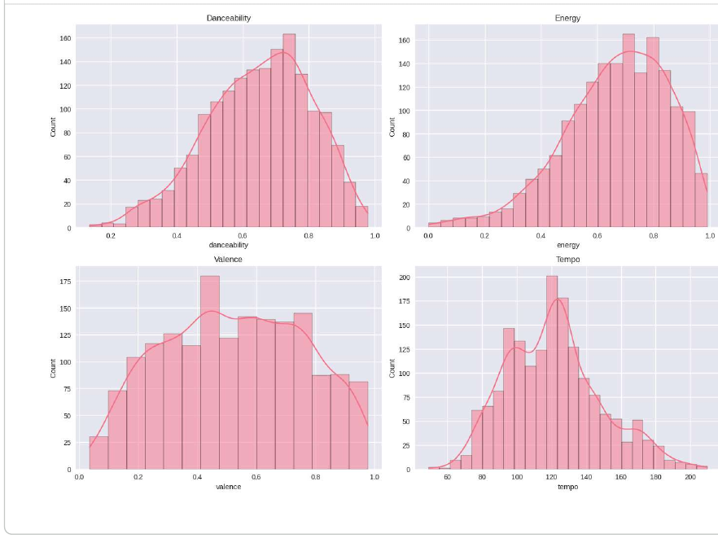

- **Danceability:** forte concentração entre 0,55 e 0,85, pico próximo de 0,7; poucos casos abaixo de 0,3; leve assimetria à esquerda.
- **Energy:** concentrada entre 0,6 e 0,9, pico próximo de 0,75 — predominância de músicas energéticas.
- **Valence:** a mais espalhada; concentração moderada entre 0,2 e 0,8, pico próximo de 0,4. O sucesso comercial não depende exclusivamente de músicas "felizes".
- **Tempo:** pico entre 120 e 140 BPM e poucos registros nos extremos, sugerindo padronização estrutural da indústria.

### 5.2. Variáveis numéricas — boxplots

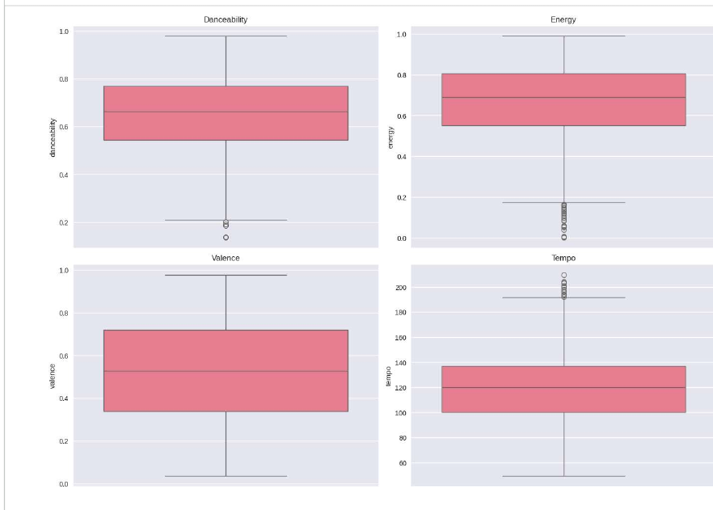

- **Danceability:** mediana ≈ 0,66; quartis entre ≈ 0,55 e 0,77; poucos outliers inferiores.
- **Energy:** quartis entre ≈ 0,55 e 0,81; vários outliers inferiores, músicas pouco energéticas também alcançam alta popularidade.
- **Valence:** maior dispersão; mediana ≈ 0,53; as músicas populares não seguem um único padrão emocional.
- **Tempo:** concentração entre ≈ 100 e 140 BPM, mediana ≈ 120 BPM; outliers superiores acima de ≈ 190 BPM.

### 5.3. Variáveis categóricas — gêneros

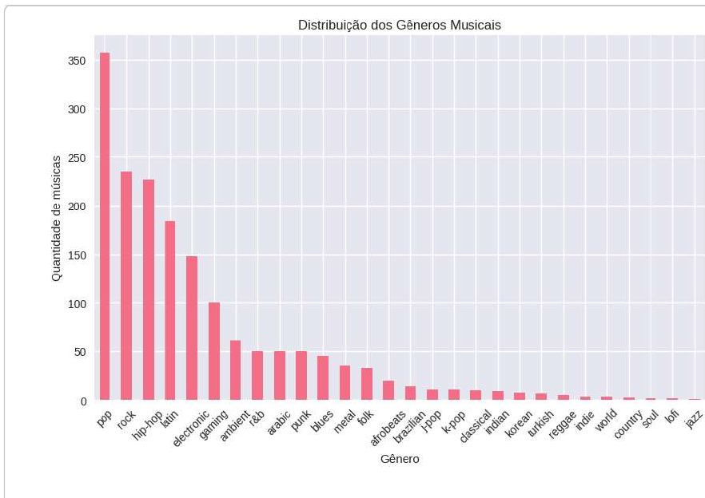

- O pop é o gênero modal, com quantidade muito superior às demais categorias (≈ 350+ músicas).
- Rock, hip-hop, latin e electronic têm participação relevante, evidenciando diversidade parcial, embora concentrada em estilos comerciais.
- Jazz, lo-fi, soul, country e world têm baixa representatividade no dataset.
- Há uma longa cauda de gêneros de baixa frequência, característica comum em plataformas digitais.

### 5.4. Variáveis categóricas — modo (maior/menor)

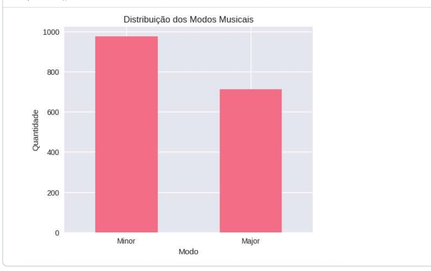

Predominância do modo menor (≈ 975) sobre o maior (≈ 710). Na teoria musical, o modo menor costuma ser associado
a emoções mais melancólicas ou introspectivas. O resultado contrasta parcialmente com os altos valores de `energy` e
`danceability`: músicas populares combinam bases energéticas e dançantes com composições emocionalmente mais profundas.

---

## 6. Análise bivariada

### 6.1. Danceability × Popularidade

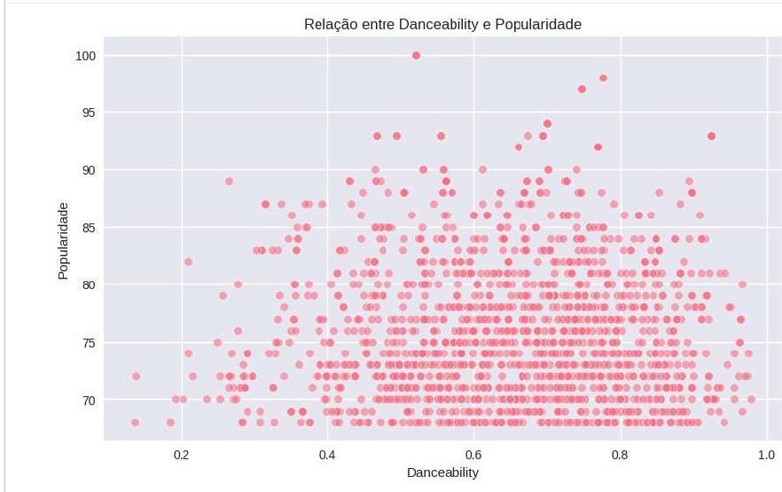

- A maior concentração está entre `danceability` ≈ 0,45 e 0,9.
- Músicas de alta popularidade aparecem em vários níveis de danceability, não só nos mais altos.
- Não há tendência linear forte: a dançabilidade, isoladamente, não explica o sucesso comercial (confirmado pela correlação ≈ 0,00 na matriz da seção 7).

### 6.2. Gênero musical × Energia

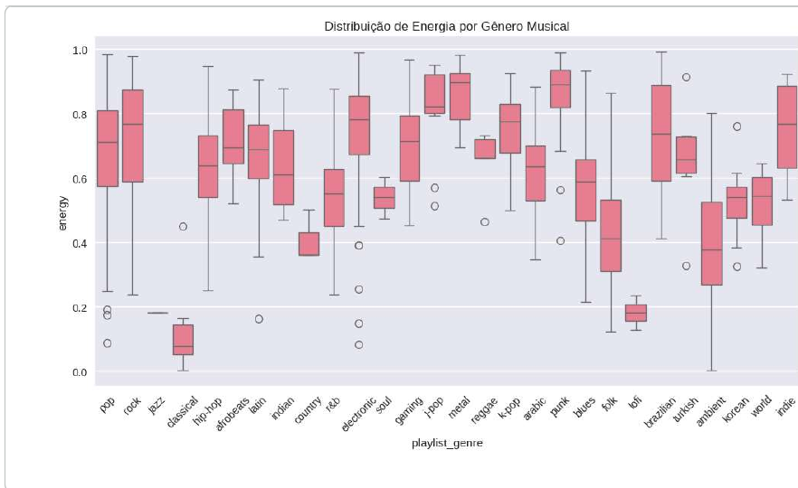

| Perfil | Gêneros | Observação |
|---|---|---|
| **Alta energia** (medianas ≈ 0,8–0,9) | metal, punk, k-pop, electronic, indie | Músicas intensas e de forte impacto sonoro |
| **Baixa energia** | classical, jazz, lofi, folk | Estilos calmos e instrumentais |
| **Alta dispersão** | pop, rock, hip-hop, latin | Grande variedade interna |

Há outliers em vários gêneros, mostrando que existe diversidade dentro de cada categoria.

> **Cautela:** gêneros pouco frequentes (jazz, lofi, classical...) têm caixas baseadas em poucas músicas; suas
> medianas são menos confiáveis. O notebook inclui uma tabela com o tamanho da amostra por gênero.

---

## 7. Análise multivariada

| Relação | Correlação | Leitura |
|---|---:|---|
| energy × loudness | +0,69 | Músicas mais energéticas têm maior volume — a correlação positiva mais forte |
| energy × acousticness | −0,61 | Músicas acústicas tendem a ser menos intensas |
| loudness × acousticness | −0,48 | Acústicas tendem a ser mais suaves |
| loudness × instrumentalness | −0,36 | Instrumentais tendem a ser menos altas |
| danceability × valence | +0,35 | Relação moderada |
| energy × valence | +0,33 | Relação moderada |
| danceability × speechiness | +0,25 | Fraca |
| `track_popularity` × demais | −0,14 a +0,08 | Praticamente nenhuma relação linear |

O achado central: `track_popularity` tem correlações muito fracas com todos os atributos sonoros (a maior em
módulo é com `speechiness`, −0,14). Isso sugere que a popularidade não depende exclusivamente de fatores técnicos, e
possivelmente seja influenciada por algoritmos de recomendação, viralização, marketing e comportamento do público.

> **Ressalva estatística importante:** o dataset contém apenas músicas já populares (`track_popularity` aprox. entre
> 68 e 100, conforme o gráfico de dispersão). Essa restrição de amplitude tende, por si só, a reduzir as
> correlações. Assim, o resultado significa que, entre músicas já populares, os atributos sonoros pouco explicam
> quem fica mais ou menos alto, e não que esses atributos sejam irrelevantes para a popularidade em geral.

---

## 8. Medidas de tendência central

Variáveis numéricas analisadas: `energy`, `tempo`, `danceability`, `loudness`, `valence`, `track_popularity`, `duration_ms`.

### 8.1. Média, mediana e moda

| Variável | Soma | n | **Média** | **Mediana** | **Moda(s)** | Repetições da moda |
|---|---:|---:|---:|---:|---|---:|
| `energy` | 1.124,93 | 1.686 | **0,67** | **0,69** | 0,586 | 11 |
| `tempo` | 204.125,60 | 1.686 | **121,07** | **120,00** | 117,038 | 5 |
| `danceability` | 1.096,51 | 1.686 | **0,65** | **0,66** | 0,671 | 12 |
| `loudness` | −11.303,17 | 1.686 | **−6,70** | **−5,97** | −5,493 | 6 |
| `valence` | 886,39 | 1.686 | **0,53** | **0,53** | 0,465 e 0,72 | 8 |
| `track_popularity` | 127.809,00 | 1.686 | **75,81** | **75,00** | 70 | 131 |
| `duration_ms` | 361.751.744,00 | 1.686 | **214.562,13** | **211.180,00** | 256.000 | 6 |

**Como se calcula a mediana (exemplo com `tempo`).** Como *n* = 1.686 é par, a mediana é a média dos dois valores
centrais (posições 842 e 843 da lista ordenada):

| Posição | Valor | Observação |
|---:|---:|---|
| 840 | 120,000 | – |
| 841 | 120,001 | – |
| **842** | **120,001** | **valor mediano** |
| **843** | **120,001** | **valor mediano** |
| 844 | 120,003 | – |
| 845 | 120,011 | – |

Mediana = (120,001 + 120,001) / 2 = **120,001**.

> **Sobre a moda em variáveis contínuas.** Em `energy`, `tempo`, `loudness` etc., quase todos os valores são distintos,
> então a "moda" é apenas um valor que se repetiu 5–12 vezes entre 1.686 — tem pouco significado prático.
> A moda é informativa de fato em variáveis **discretas** (`track_popularity`: 70, com 131 ocorrências) e
> **categóricas** (`playlist_genre`: pop). Para variáveis contínuas, a **classe modal** (seção 10) é mais adequada.

### 8.2. Média × mediana

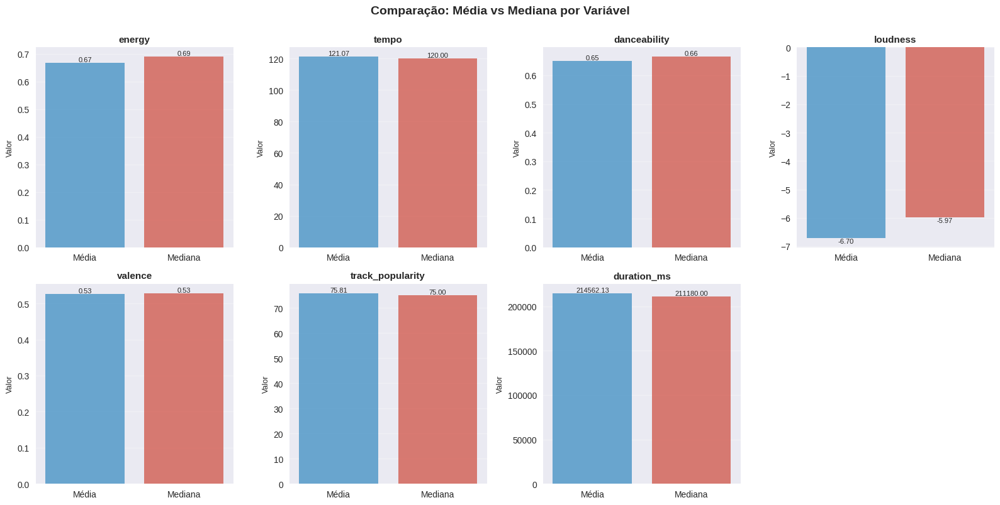

A proximidade entre média e mediana na maior parte das variáveis indica distribuições **relativamente equilibradas**.
A variável em que a diferença é mais relevante é `loudness` (média −6,70 vs. mediana −5,97). Em relação ao desvio
padrão (3,38), a diferença é a maior entre as variáveis (≈ 0,22 desvios), e é coerente com o outlier de −43,6 dB que
puxa a média para baixo.

### 8.3. Conclusão parcial

- predominância de músicas **energéticas**;
- forte **potencial de dança**;
- BPM **padronizado** (~120);
- **volume sonoro elevado**;
- **duração** comercialmente otimizada (≈ 3,5 min);
- diversidade emocional **moderada**.

---

## 9. Medidas de dispersão

A **variância** mede o espalhamento dos dados em relação à média; o **desvio padrão** é sua raiz quadrada, na mesma
unidade da variável.

| Variável | Variância | Desvio padrão | Coef. de variação¹ |
|---|---:|---:|---:|
| `energy` | 0,03 | 0,18 | 27% |
| `tempo` | 732,57 | 27,07 | 22% |
| `danceability` | 0,02 | 0,16 | 25% |
| `loudness` | 11,40 | 3,38 | 50% |
| `valence` | 0,06 | 0,24 | 45% |
| `track_popularity` | 36,39 | 6,03 | **8%** |
| `duration_ms` | 3.400.143.000 | 58.310,75 | 27% |

¹ *Coeficiente de variação = desvio padrão ÷ |média|. Calculado a partir dos valores da tabela.*

Variâncias de variáveis em **escalas diferentes não são comparáveis diretamente** (a de `duration_ms` é enorme apenas
porque a unidade é o milissegundo). O coeficiente de variação padroniza a comparação e mostra que
`track_popularity` é a variável **mais concentrada** (8%) — coerente com o fato de o dataset conter apenas músicas
já populares — enquanto `loudness` e `valence` são as mais dispersas em termos relativos.

---

## 10. Dados agrupados em classes

Para a variável contínua `tempo`, os dados foram agrupados em **5 classes de mesma amplitude**. As medidas são calculadas
a partir do **ponto médio** e da **frequência** de cada classe.

### 10.1. Distribuição de frequências

| Classe (BPM) | Ponto médio | Qtde | % | Freq. acumulada |
|---|---:|---:|---:|---:|
| (49,145 ; 81,382] | 65,2635 | 101 | 5,99 | 101 |
| (81,382 ; 113,458] | 97,4200 | 562 | 33,33 | 663 |
| **(113,458 ; 145,535]** | 129,4965 | **730** | **43,30** | 1.393 |
| (145,535 ; 177,611] | 161,5730 | 241 | 14,29 | 1.634 |
| (177,611 ; 209,688] | 193,6495 | 52 | 3,08 | 1.686 |

### 10.2. Média agrupada

$$\bar{x}_{agr} = \frac{\sum (PM_i \cdot f_i)}{\sum f_i} = \mathbf{121{,}52}$$

Comparação: média real (dados brutos) = **121,07** — diferença de apenas ≈ 0,45 BPM.

### 10.3. Classe modal e mediana agrupada

- **Classe modal:** (113,458 ; 145,535], com **730 músicas (43,30%)**.
- **Classe mediana:** a mesma, pois a frequência acumulada cruza *n*/2 = 843 nessa classe (663 → 1.393).

Complementando o trabalho original (que apresentou apenas as tabelas), aplicando as fórmulas de interpolação
sobre a tabela de frequências acima:

| Medida | Fórmula | Resultado |
|---|---|---:|
| Mediana agrupada | $L + \frac{n/2 - F_{ant}}{f} \cdot h$ | **≈ 121,41** |
| Moda de Czuber | $L + \frac{d_1}{d_1 + d_2} \cdot h$ | **≈ 121,70** |

(com *h* = 32,237 BPM). Ambas ficam próximas da mediana real (120,00) e da média (121,07), o que reforça a leitura de
uma distribuição concentrada em torno de 120 BPM.

### 10.4. Variância e desvio padrão agrupados

| Classe | Ponto médio | Qtde | Desvio quadrático (PM − x̄)² | Desvio quad. × freq. |
|---|---:|---:|---:|---:|
| (49,145 ; 81,382] | 65,2635 | 101 | 3.164,81 | 319.645,82 |
| (81,382 ; 113,458] | 97,4200 | 562 | 580,82 | 326.419,16 |
| (113,458 ; 145,535] | 129,4965 | 730 | 63,62 | 46.444,22 |
| (145,535 ; 177,611] | 161,5730 | 241 | 1.604,23 | 386.619,70 |
| (177,611 ; 209,688] | 193,6495 | 52 | 5.202,64 | 270.537,47 |
| **Σ** | | **1.686** | | **≈ 1.349.666** |

$$s^2_{agr} = \frac{\sum f_i (PM_i - \bar{x}_{agr})^2}{n-1} \approx \mathbf{801} \qquad s_{agr} \approx \mathbf{28{,}3}$$

Os valores acima foram recalculados a partir da tabela e conferem com os do trabalho original (diferenças apenas de arredondamento).

**Comparação com os dados brutos:** variância real = 732,57 e desvio padrão real = 27,07. A variância agrupada é
**≈ 9% maior**. O agrupamento é uma **aproximação**: ao assumir que todos os valores de uma classe são iguais ao ponto
médio, descarta-se a variação *dentro* de cada classe. Uma correção clássica é a *correção de Sheppard*
($s^2 \approx s^2_{agr} - h^2/12$), que aqui daria ≈ 714 — mais próxima do real (a diferença cai para ≈ 2,5%).
O resultado depende do número de classes: mais classes → aproximação melhor.

---

## 11. Machine Learning: classificação do gênero musical

Esta parte responde a uma pergunta que decorre das anteriores: se as características sonoras variam entre os
gêneros (seção 6.2) mas quase não explicam a popularidade (seção 7), **é possível prever o gênero de uma música
a partir do seu som?** Segue-se a metodologia **CRISP-DM**.

### 11.1. Base de dados desta parte

| Partes | Base | Linhas |
|---|---|---:|
| II e III (exploratória e estatística) | Dataset completo (música × playlist) | 1.686 |
| IV (Machine Learning) | Faixas únicas dos gêneros com ≥ 30 faixas | **1.261** (1.008 treino / 253 teste) |

- **Alvo:** `playlist_genre`, o gênero da **playlist**, e não um rótulo intrínseco da faixa.
- **Variáveis descartadas:** identificadores, links, nomes, data de lançamento e `playlist_name`.
  A `playlist_subgenre` foi descartada **de propósito**, pois praticamente entrega o gênero (vazamento de dados).

### 11.2. Preparação

1. **Remoção de faixas repetidas** por `track_id`: 1.686 → 1.437 faixas (249 repetições). Evita que a mesma música apareça no treino e no teste.
2. **Filtro de gêneros raros:** foram mantidos os gêneros com **≥ 30 faixas** — 10 gêneros: *pop, rock, hip-hop, latin, electronic, gaming, ambient, r&b, punk* e *blues* (1.437 → 1.261 faixas).
3. **Divisão treino/teste** 80/20 com `stratify`, feita **antes** de qualquer padronização.
4. **`StandardScaler` ajustado só com o treino**, apenas aplicado ao teste.

A distribuição é **muito desbalanceada**: pop (299), rock (206) e hip-hop (201) têm centenas de faixas; o jazz tem uma só.
O *folk*, com 29, ficou logo abaixo do corte.

> **Efeito do filtro:** o problema passa a ser "prever entre os 10 gêneros mais frequentes". O modelo não pode prever
> os gêneros removidos, e os resultados não se generalizam para o catálogo completo.

### 11.3. Faixas repetidas: vazamento e ruído de rótulo

Manter uma linha por faixa (`keep='first'`) tem duas consequências:

- ✅ **Evita vazamento:** a mesma música não está mais em treino e teste ao mesmo tempo.
- ⚠️ **Introduz ruído de rótulo:** se a faixa estava em playlists de gêneros diferentes, o gênero mantido é o da primeira
  ocorrência no arquivo, uma escolha arbitrária. Isso impõe um limite prático à acurácia possível. O notebook mede
  quantas faixas estão nessa situação (seção 13.3 do notebook).

### 11.4. Análise exploratória direcionada

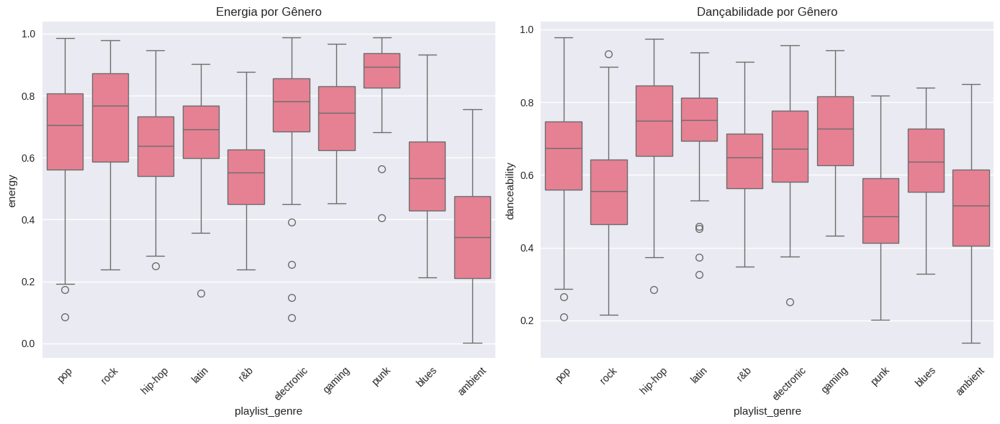

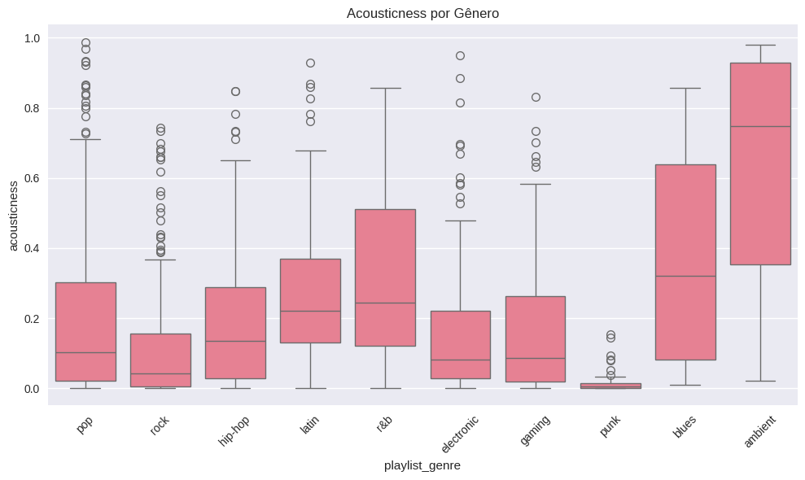

- *Ambient* e *r&b* têm energia visivelmente mais baixa que *punk* e *rock*; o *ambient* tem `acousticness` alto e disperso; o *punk* concentra valores baixíssimos. **As características sonoras carregam informação sobre o gênero.**
- Há, porém, **muita sobreposição** entre as caixas de pop, rock, hip-hop, latin e electronic, o que antecipa a dificuldade da tarefa.

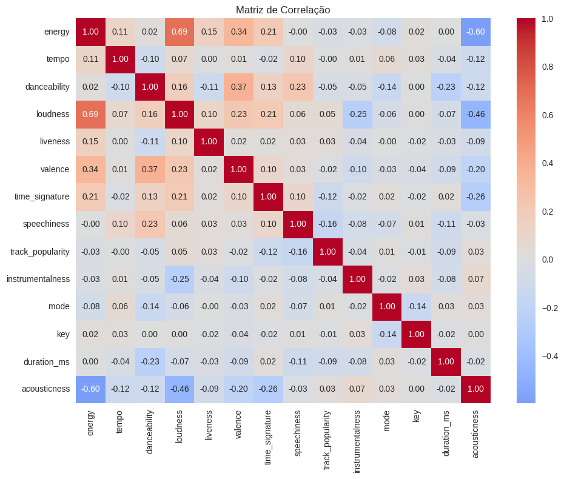

A matriz repete o que a seção 7 mostrou: `energy` × `loudness` ≈ **+0,69** e `energy` × `acousticness` ≈ **−0,60**.
Variáveis correlacionadas dividem a importância entre si nos modelos.

### 11.5. Modelagem

| # | Modelo | Configuração |
|---|---|---|
| 0 | Baseline | `DummyClassifier`, sempre o gênero mais frequente (referência, complemento desta unificação) |
| 1 | Regressão Logística | `max_iter=1000` |
| 2 | KNN | `k = 5` |
| 3 | Árvore de Decisão | `max_depth=10` |
| 4 | Random Forest | `n_estimators=200` |

Todos com `random_state=42`. **Não houve ajuste de hiperparâmetros.**

### 11.6. Resultados

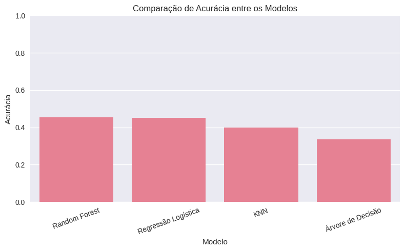

| Modelo | Acurácia | F1 (ponderado) | Acertos (de 253) |
|---|---:|---:|---:|
| **Random Forest** | **0,455** | 0,436 | 115 |
| Regressão Logística | 0,451 | 0,433 | 114 |
| KNN | 0,399 | 0,395 | 101 |
| Árvore de Decisão | 0,336 | 0,335 | 85 |
| *Baseline "sempre pop"* | *≈ 0,237* | — | *60* |
| *Sorteio uniforme (10 classes)* | *0,100* | — | — |

**Como ler:**

- **Contra o acaso.** O sorteio uniforme acertaria ≈ 10%, mas a referência mais justa é o **baseline "sempre pop"**
  (60 das 253 músicas de teste são pop): **≈ 23,7%**. Os modelos superam esse patamar; o melhor chega a ≈ 45%. As
  características sonoras têm poder preditivo real, porém **moderado**.
- **Random Forest × Regressão Logística: empate técnico.** A diferença é de **um acerto** (115 contra 114). Com um
  único conjunto de teste pequeno, isso não permite afirmar que o Random Forest é melhor. O notebook inclui **validação
  cruzada** (5 partições) como complemento.
- **A árvore única é claramente pior**, algo esperado, pois tende a sobreajustar em conjuntos pequenos; o Random
  Forest reduz isso combinando muitas árvores.

### 11.7. Matriz de confusão e desempenho por gênero

| Gênero | Precisão | Revocação | F1 | Suporte |
|---|---:|---:|---:|---:|
| rock | 0,53 | 0,56 | **0,55** | 41 |
| hip-hop | 0,45 | 0,62 | **0,53** | 40 |
| punk | 0,67 | 0,40 | 0,50 | 10 |
| pop | 0,40 | 0,55 | 0,46 | 60 |
| electronic | 0,53 | 0,37 | 0,43 | 27 |
| latin | 0,44 | 0,36 | 0,40 | 33 |
| ambient | 0,33 | 0,50 | 0,40 | 10 |
| blues | 1,00 | 0,14 | 0,25 | 7 |
| r&b | 0,50 | 0,10 | 0,17 | 10 |
| gaming | 0,33 | 0,07 | **0,11** | 15 |
| **Acurácia** | | | **0,45** | 253 |
| *Macro avg* | 0,52 | 0,37 | 0,38 | 253 |

- **O *pop* funciona como "classe atratora".** O modelo previu *pop* **82 vezes**, mas há só 60 músicas pop no teste:
  **49 previsões de pop estavam erradas**. Caíram nele 11 faixas de *rock*, 9 de *latin*, 9 de *electronic* e 7 de
  *gaming*. Como o pop é o gênero mais frequente, errar para ele é o caminho de menor risco.
- **Acertos moderados nos gêneros grandes:** *hip-hop* (25 de 40), *rock* (23 de 41), *pop* (33 de 60).
- **Gêneros pequenos são os mais difíceis:** *r&b* teve **1 acerto em 10** (4 foram classificados como *hip-hop*),
  *gaming* 1 em 15 e *blues* 1 em 7.
- A revocação média entre classes (*macro avg* ≈ 0,37) é menor que a acurácia global (0,45): o modelo se sai melhor
  nos gêneros grandes. O *blues* tem precisão 1,00, mas com **uma única previsão** e 7 amostras, o número é pouco confiável.
- O desbalanceamento **não foi tratado** (sem `class_weight` nem reamostragem), o que ajuda a explicar esse padrão.

### 11.8. Importância das variáveis (Random Forest)

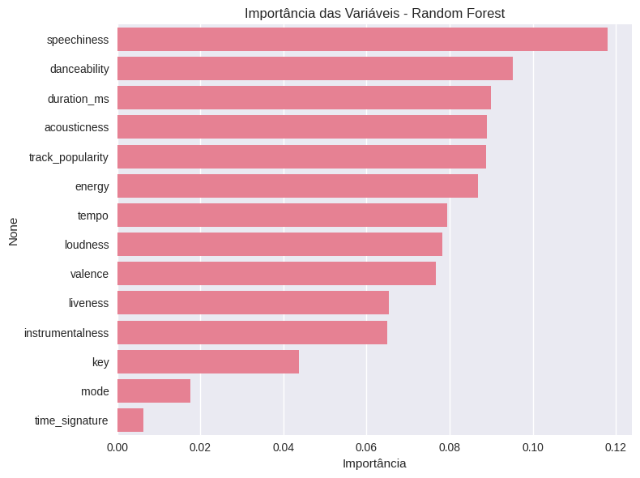

- **Não há variável dominante.** `speechiness` (≈ 0,12) e `danceability` (≈ 0,095) lideram, seguidas de `duration_ms`,
  `acousticness`, `track_popularity` e `energy` (≈ 0,09). Da 1ª à 11ª posição a importância varia só de ≈ 0,12 a ≈ 0,065.
- `speechiness` em 1º lugar é plausível: gêneros como *hip-hop* têm mais fala.
- **`instrumentalness` tem importância baixa** (11ª de 14), apesar do destaque do *ambient*: a maioria das faixas tem
  valores muito baixos, então a variável separa poucos casos.
- `key`, `mode` e `time_signature` são as menos relevantes.

**Cuidados na interpretação:** (1) a importância por impureza **favorece variáveis contínuas com muitos valores distintos**
(como `duration_ms` e `track_popularity`); (2) **`track_popularity` não é uma característica sonora**, e sua posição pode
refletir diferenças de popularidade entre playlists; (3) variáveis correlacionadas (`energy`, `loudness`, `acousticness`)
dividem a importância.

### 11.9. Conclusão da Parte IV

- O gênero da playlist é **previsível acima do acaso e acima do baseline** (≈ 45% contra ≈ 24%), mas **não o suficiente**
  para uma classificação confiável.
- Os quatro modelos ficaram entre 34% e 46%; Random Forest e Regressão Logística estão empatados na prática.
- As dificuldades vêm principalmente dos **dados** (gêneros sobrepostos, desbalanceamento, rótulo dependente da
  playlist, faixas em mais de um gênero), e não da falta de sofisticação do algoritmo.
- Cuidados contra vazamento: remoção de repetições, exclusão de `playlist_subgenre`, divisão antes da padronização e
  `StandardScaler` ajustado só no treino.

---

## 12. Conclusão geral

**Perfil e distribuição (Partes II e III)**

1. **Perfil predominante.** As músicas populares do Spotify são majoritariamente **energéticas, dançantes, com volume elevado, ~120 BPM e ~3,5 min**, características associadas à música comercial contemporânea.
2. **Concentração de gêneros.** O **pop** domina, seguido por rock, hip-hop, latin e electronic, com longa cauda de gêneros de nicho.
3. **Diferenças entre gêneros.** Metal, punk, k-pop e electronic são os mais energéticos; classical, jazz, lofi e folk, os menos.
4. **Relações entre atributos.** Energy, loudness e danceability estão relacionadas; acousticness se opõe a energy e loudness.
5. **Estatística.** Distribuições relativamente equilibradas; o tratamento de dados agrupados reproduz bem média e mediana, com aproximação menos precisa para a variância.

**Popularidade × gênero (o contraste central)**

6. **Popularidade.** Baixa correlação com os atributos sonoros e baixa dispersão (desvio ≈ 6). Entre músicas já populares, o som **quase não explica** quem é mais popular. Provavelmente há influência de algoritmos, marketing e viralização.
7. **Gênero.** Ao contrário da popularidade, o gênero **é parcialmente previsível** pelo som (≈ 45% contra ≈ 24% do baseline), embora longe de ser confiável.

Os dois resultados se complementam: as características sonoras descrevem **o estilo** de uma música razoavelmente bem, mas
descrevem **o seu sucesso** muito mal. O limite na previsão do gênero é coerente com a **alta dispersão interna** dos
gêneros observada na Parte II. De forma geral, o consumo musical moderno é um fenômeno **complexo e multifatorial**.

## 13. Limitações e trabalhos futuros

**Limitações**

- O dataset contém **apenas músicas já populares**, o que restringe a amplitude de `track_popularity` e enfraquece as correlações (seção 7). Não se pode concluir que o som seja irrelevante para a popularidade em geral.
- **Correlação não implica causalidade.**
- O alvo do ML é o gênero da **playlist**, e não da faixa; faixas em várias playlists foram reduzidas a uma linha (`keep='first'`), o que introduz ruído de rótulo.
- O modelo cobre só os **10 gêneros com ≥ 30 faixas**, sem tratamento de desbalanceamento e sem ajuste de hiperparâmetros.
- A avaliação principal usa um único *split* de 253 músicas (complementada por validação cruzada no notebook).
- Gêneros com poucas músicas geram estimativas pouco confiáveis (seção 6.2 e 11.7).
- O corte de "popular" e a data de extração afetam o retrato obtido.

**Trabalhos futuros**

- Comparar com `low_popularity_spotify_data.csv` (mesmo dataset no Kaggle) para investigar o que diferencia músicas de alta e baixa popularidade.
- Tratar o desbalanceamento (`class_weight='balanced'`, reamostragem) e ajustar hiperparâmetros (`GridSearchCV`).
- Testar outros modelos (*gradient boosting*) e outras métricas (F1 macro).
- Testes de hipótese e intervalos de confiança para diferenças entre gêneros.
- Modelos de regressão/classificação da popularidade.

---

## 14. Observações sobre a unificação dos trabalhos

Este repositório reúne **três** trabalhos independentes sobre o mesmo dataset. Ao unificá-los, foram identificados os
pontos abaixo, registrados aqui para transparência.

**Inconsistências entre os trabalhos**

| # | Ponto | Como foi tratado |
|---|---|---|
| 1 | **Duplicatas divergentes** (0 vs. 99 vs. 249): critérios diferentes (29 colunas, 10 colunas, `track_id`). | Explicado na seção 4.4. O notebook reproduz os três diagnósticos. |
| 2 | O relatório de Estatística afirma "*sem linhas duplicadas*", mas sua própria saída mostra **99**. | Contextualizado (seção 4.4). |
| 3 | O **valor ausente** só aparece no trabalho de Big Data (coluna `track_album_name`, que os demais não usam). | Documentado na seção 4.3; resolvido com `keep_default_na=False` + `na_values=['']`, e o notebook confere que o valor preservado é o texto "NA". |
| 4 | Bases de **tamanhos diferentes** entre as partes (1.686 vs. 1.261 linhas). | Tornado explícito na seção 11.1: exploratória/estatística usam o dataset completo; o ML usa faixas únicas para evitar vazamento. |
| 5 | Títulos de seção **duplicados/truncados** no relatório de Estatística (seções 5 e 6 chamadas "Importação das bibliotecas"; seção "9. MED"). | Reorganizados em numeração única (1 a 14). |
| 6 | Seções de **mediana, classe modal e variância agrupadas** apresentavam só tabelas, sem o valor final. | Valores calculados a partir das tabelas do próprio trabalho (seção 10). |
| 7 | O relatório de Estatística menciona "*outliers*" e "*matriz de correlação*" na conclusão, análises feitas no notebook exploratório. | As partes agora coexistem no mesmo documento. |
| 8 | Os notebooks liam do caminho `/kaggle/input/datasets/solomonameh/...`. | O notebook unificado testa vários caminhos (Kaggle, `data/`) e faz busca automática no Kaggle. |

**Correções de conteúdo no trabalho de Machine Learning**

| # | Texto original | Problema | Correção |
|---|---|---|---|
| 9 | "*instrumentalness está entre as mais importantes*" | No gráfico é a **11ª de 14** (≈ 0,065). | Texto reescrito conforme o gráfico (seção 11.8). |
| 10 | "*bom desempenho para pop e rock; hip-hop e r&b com mais confusão*" | A matriz mostra outro padrão: o **pop atrai** previsões de outros gêneros; *hip-hop* está entre os mais bem classificados; o problema é o *r&b* (1 de 10). | Reescrito (seção 11.7). |
| 11 | "*acaso acertaria em torno de 10%*" | O baseline mais justo é "sempre pop" (≈ 23,7%), pois as classes são desbalanceadas. | Adicionados baseline e a comparação (seção 11.6). |
| 12 | "*Random Forest apresentou o melhor desempenho*" | A diferença para a Regressão Logística é de **1 acerto** em 253. | Registrado como empate técnico; incluída validação cruzada no notebook. |
| 13 | Gráfico de importância com eixo Y rotulado "None"; matriz de confusão gerando uma figura vazia extra. | Detalhes de código. | Corrigidos no notebook. |
| 14 | Filtro de gêneros e remoção de duplicatas descritos sem discutir efeitos. | Ruído de rótulo (`keep='first'`) e perda de generalização. | Discutidos nas seções 11.2, 11.3 e 13. |

**Correções de conteúdo nos trabalhos exploratório e estatístico**

| # | Ponto | Como foi tratado |
|---|---|---|
| 15 | Rótulos do gráfico de **modo** atribuídos por posição (`index = ['Minor','Major']`). | O resultado original estava correto neste dataset, mas foi trocado por mapeamento explícito `{0:'Minor', 1:'Major'}`, mais robusto. |
| 16 | A **moda** era calculada para variáveis contínuas sem ressalva. | Mantida, com nota sobre seu pouco significado nesses casos (seção 8.1). |

---

## Referências

- Dataset: SOLOMONAMEH. *Spotify Music Dataset*. Kaggle. <https://www.kaggle.com/datasets/solomonameh/spotify-music-dataset>
- Trabalho de Big Data (notebook Kaggle): <https://www.kaggle.com/code/ramonlodi/projeto-big-data>
- Vídeo de apresentação (Big Data): <https://www.loom.com/share/4d6563cc3bc14d7fb57818a299ce1074>
